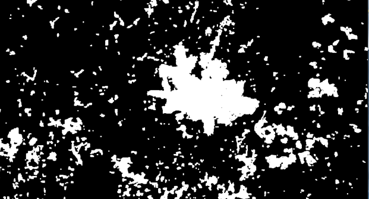
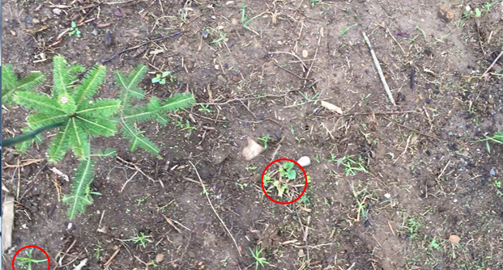
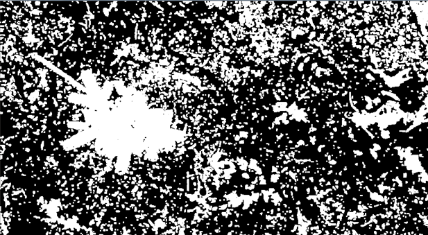
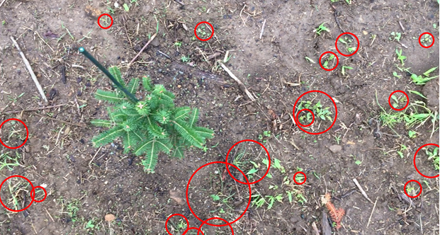

# UndesirablePlantIdentification
Main EE551 Semester Project

In order to run the package:
-	Clone this repository to your local
-	Create a new virtual envirnonment
-	Install OpenCV, NumPy, and Pytest modules
-	Working on the new envirnoment, root into the repository UndesirablePlantIdentification
-	In cmd, write "python src/main.py --video Video/vid1.MOV
-	Enter - the proccessed example video will display. Press q to exit or let the video run out.

Project Outcomes:

In this project, I was able to successfully utilize OpenCV's API to identify weeds in a crop row. The program works by loading a video file through the command prompt and iterating through the frames. Each frame of the video is first converted from BGR (blue, green, red) to HSV (hue, saturation, value). A range of HSV values is defined that represent a green color range. Each frame is then evaluated for regions where the colors are in the HSV range. A bitwise mask is generated and evaluated and positive areas (white area) is contoured. Contours in a certain range of area are then identifed and encompassing circles are drawn on the original frame, effectively identifying the location of a weed.

Additional refining is needed. Adjusting the HSV range can capture more colors. Increasing the range of the contour area can capture more larger/smaller groupings. Making the ranges too large can lead to false positives, while too small can lead to low identification rates.

Original Project Proposal:
	
There are 915 million acres of farm land in the United States, all of which use harmful herbicides to kill weeds that inhibit the production of the crops. These herbicides are necessary to make farming fiscally possible but the environmental and human damage these carcinogenic chemicals cause is unacceptable. This project will utilize Python’s image processing and machine learning capabilities to identify known weeds in a farm setting. This capability can allow for the identification of weeds and the subsequent precision application of herbicides. The precision application of herbicides could drastically reduce the amount of chemicals applied to our land, its stewards, and our crops.  

Architecture:  
•	Python Image Processing Library  
	-To enable the analysis and data collection of single images  
	-Possibly OpenCV  
•	Python ML Library  
	-To implement an artificial neural network and decision making capabilities  
	-Possibly Tensorflow  
•	Other Standard Python Libraries  
	-NumPy  
	-SciPy  

To Do & Delivery Dates:  
2/22 – Choose Image Processing Library  
2/22 – Choose ML Library  
2/22 – Identify any other Libraries Needed  
3/1 – Have libraries functioning  
3/8 – Be able to conduct image processing  
3/29 – Have image data (visit to local farm to gather photos/source from google or database)  
4/5 – Be able to process select images of weeds and categorize  
4/19 – Work on expansion of exposure to images and be able to identify weeds consistently  
4/26 – Cleaned up organization and documentation – Final 
